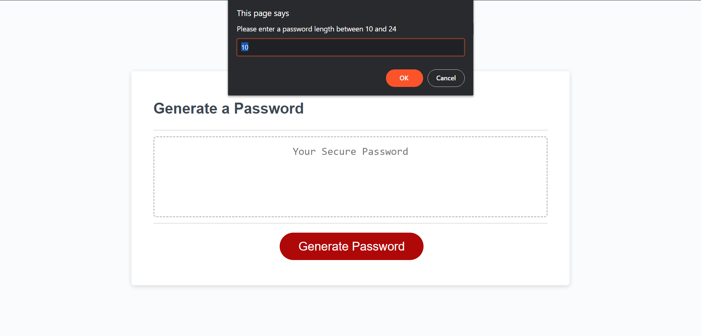

# Password-Generator
Trilogy Bootcamp Module 5 Challenge - Password Generator

## Description 

This project generates a random password for the user, using the types of characters that the user selects. The code:
- Prompts the user for:
    - Length of password (10-64 characters)
    - Character types
        - Lowercase
        - Uppercase
        - Numeric
        - Special characters
- Generates and displays a password based on the user's preference

## Table of Contents

* [Installation](#installation)
* [Usage](#usage)
* [License](#license)

## Installation

N/A

## Usage 

Access website at https://sulaiman-ai.github.io/Password-Generator/

1. Click the generate password button
2. Fill in the prompts with your desired password options

## License

Please refer to the license in the repo.